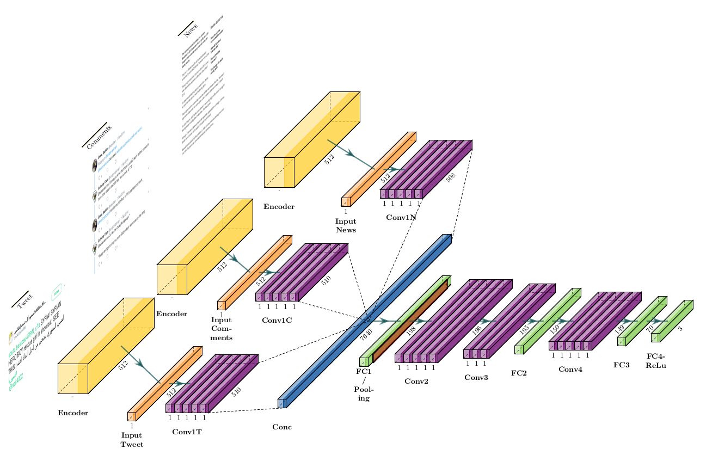

# Hands-on pipeline

1. [What is NLP?](https://machinelearningmastery.com/natural-language-processing/)
1. [Where is it used?](https://machinelearningmastery.com/natural-language-processing/)
1. [What we will need for the hands-on](#start-handsOn)
	- [Colaboratory notebook](#colab)
	- [Setup the environment](#setup)
1. [Text pre-processing](https://towardsdatascience.com/nlp-text-preprocessing-a-practical-guide-and-template-d80874676e79)
	- Stop-words
	- Stemming
	- Lemmatization
	- [Regular expressions](https://www.w3schools.com/python/python_regex.asp)
1. [How the computer understand text?](#vector)
	- [Text vectorization not considering semantics ](https://www.freecodecamp.org/news/an-introduction-to-bag-of-words-and-how-to-code-it-in-python-for-nlp-282e87a9da04/)
	- [Text vectorization considering semantics ](https://towardsdatascience.com/introduction-to-word-embedding-and-word2vec-652d0c2060fa)
1. [Introdution to Machine Learning - ML](https://www.coursera.org/learn/uol-machine-learning-for-all)
	- Layers
		- Convolutions 
		- Fully-connected
		- Polling
	- Activation function
1. [EMET structure](#emet)

# [EMET - אמת](#emet)

**Schwarz, S., Theóphilo, A., and Rocha, A., 2020, May. EMET: Embeddings from Multilingual Encoder Transformer for Fake News Detection. In ICASSP 2020-2020 IEEE International Conference on Acoustics, Speech and Signal Processing (ICASSP). IEEE.**

